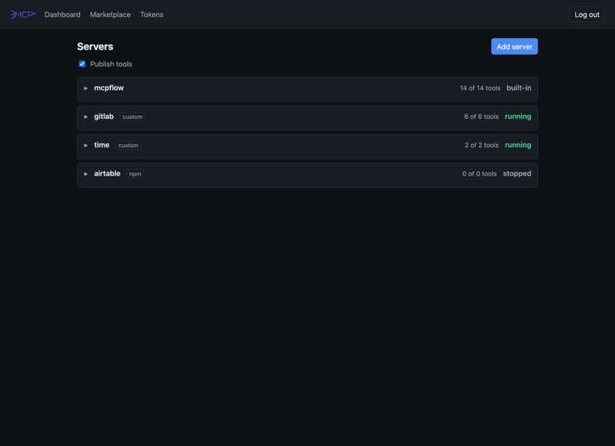
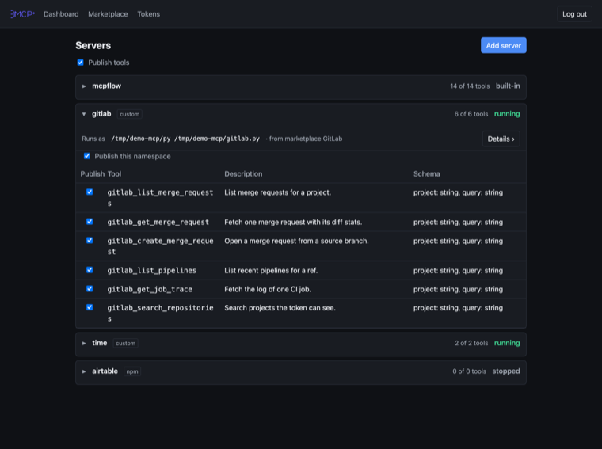
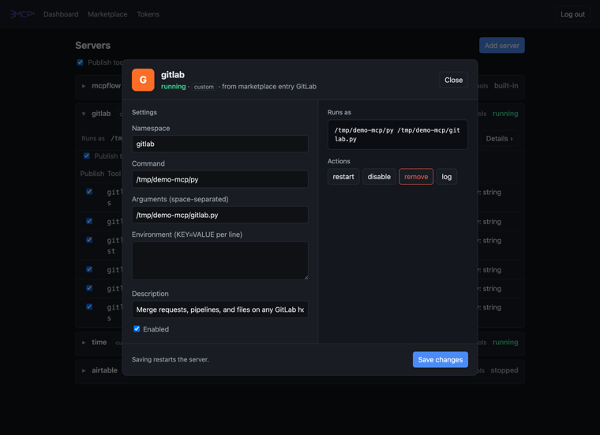
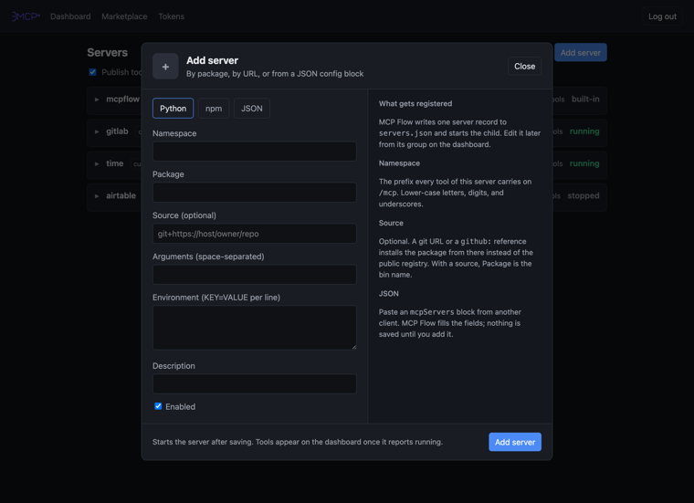
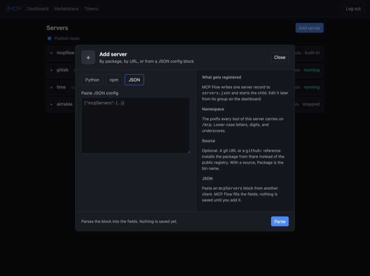
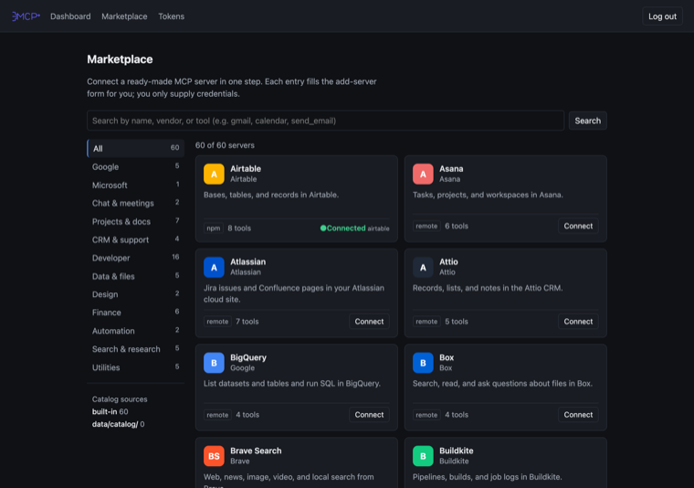
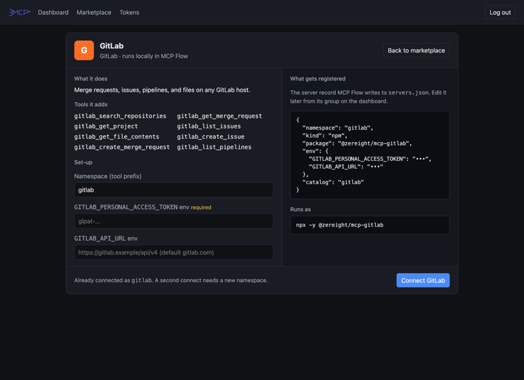
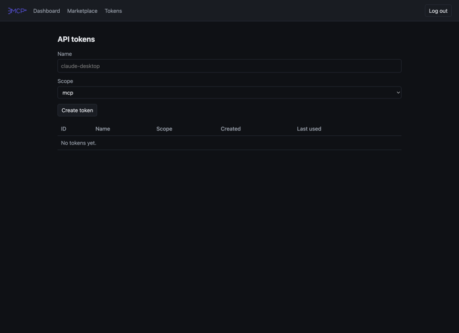

<p align="center">
  
</p>

<h1 align="center">MCP Flow</h1>

<p align="center">One gateway. Many Model Context Protocol (MCP) servers. One address for every agent.</p>

MCP Flow is one process that serves three things on one port. It serves the
MCP gateway at `/mcp`. It serves an admin web user interface (UI). It serves a
health endpoint at `/health`. The Python package and the console command keep
the name `mcpflow`.

The gateway runs child MCP servers as subprocesses. It also proxies remote MCP
servers. A failed child does not stop the gateway or another child. A change to
a child takes effect without a process restart.

## How it works

```
  agent ──┐                          ┌── uvx  <python package>   (namespace a)
  agent ──┼── Bearer token ──► /mcp ─┼── npx  <npm package>      (namespace b)
  agent ──┘        MCP Flow          ├── https://remote/mcp      (namespace c)
                      │              └── mcpflow_*  built-in admin tools
             /login  /  /marketplace  /tokens  /api
```

- An agent connects to `/mcp` with one bearer token. The gateway publishes every visible
  tool of every running child as `{namespace}_{tool}`. A muted tool stays hidden.
- The admin adds, edits, mutes, and restarts children in the web UI, over the
  Representational State Transfer (REST) application programming interface
  (API) at `/api`, or with the built-in `mcpflow_*` MCP tools.
- The gateway keeps its persistent state under one data directory. See "Files under
  `DATA_DIR`".

## Screens

Select a picture to open it at full size.

<table>
  <tr>
    <td width="50%">
      <a href="docs/screenshots/01-dashboard.png"></a>
      <br><b>Dashboard.</b> One collapsible group per registered server.
    </td>
    <td width="50%">
      <a href="docs/screenshots/02-dashboard-group-expanded.png"></a>
      <br><b>An expanded group.</b> The run command, then every tool it publishes.
    </td>
  </tr>
  <tr>
    <td width="50%">
      <a href="docs/screenshots/03-server-window.png"></a>
      <br><b>Server window.</b> Edit, restart, disable, remove, and read the log.
    </td>
    <td width="50%">
      <a href="docs/screenshots/04-add-server.png"></a>
      <br><b>Add a server.</b> By Python package, by npm package, or by URL.
    </td>
  </tr>
  <tr>
    <td width="50%">
      <a href="docs/screenshots/05-add-server-json.png"></a>
      <br><b>Paste a config.</b> An <code>mcpServers</code> block from another client fills the fields.
    </td>
    <td width="50%">
      <a href="docs/screenshots/06-marketplace.png"></a>
      <br><b>Marketplace.</b> Ready-made entries; a connected one shows its namespace.
    </td>
  </tr>
  <tr>
    <td width="50%">
      <a href="docs/screenshots/07-marketplace-detail.png"></a>
      <br><b>Marketplace entry.</b> The record it writes and the command it runs as.
    </td>
    <td width="50%">
      <a href="docs/screenshots/08-tokens.png"></a>
      <br><b>Tokens.</b> Create a bearer token and copy the client config.
    </td>
  </tr>
</table>

## Contents

- [Screens](#screens)
- [Install](#install)
- [Set the admin password](#set-the-admin-password)
- [Run the server](#run-the-server)
- [Run with Docker](#run-with-docker)
- [Environment variables](#environment-variables)
- [Files under `DATA_DIR`](#files-under-data_dir)
- [Add a server](#add-a-server)
- [Import from mcpmarket](#import-from-mcpmarket)
- [API tokens](#api-tokens)
- [Connect an agent](#connect-an-agent)
- [Admin API](#admin-api)
- [Admin MCP tools](#admin-mcp-tools)
- [Inline source servers](#inline-source-servers)
- [Development](#development)
- [License](#license)

## Install

Install the package with pip. The package needs Python 3.12 or newer.

```sh
pip install mcpflow
```

## Set the admin password

The process needs an admin password. Create a password hash first.

```sh
mcpflow hash-password
```

The command prints one line that starts with `pbkdf2_sha256$`. Set the line as
`ADMIN_PASSWORD_HASH`. You can also set the clear-text `ADMIN_PASSWORD` instead,
but the hash is safer.

## Run the server

Start the gateway with `serve`. The flags override the environment variables.

```sh
export ADMIN_PASSWORD_HASH='pbkdf2_sha256$...'
mcpflow serve --host 127.0.0.1 --port 8000 --data-dir ./data
```

Open `http://127.0.0.1:8000/login` and log in with the admin password.

## Run with Docker

Copy the example environment file and set the values.

```sh
cp .env.example .env
# set ADMIN_PASSWORD_HASH and SECRET_KEY in .env
docker compose up -d
```

The compose file builds the image, maps port `8000`, and mounts a named volume
at `/data`. Open `http://localhost:8000/login`.

The named volume is `mcpflow-data`.

To build the image from a local wheel, run `make docker-build-local`. The
command builds the wheel and passes it to Docker through a named build context.

## Environment variables

| Name | Default | Purpose |
|---|---|---|
| `DATA_DIR` | `./data` (Docker: `/data`) | registry, tokens, logs, caches |
| `HOST` | `127.0.0.1` (Docker: `0.0.0.0`) | bind address |
| `PORT` | `8000` | bind port |
| `ADMIN_PASSWORD` | unset | clear-text admin password; hashed in memory at start |
| `ADMIN_PASSWORD_HASH` | unset | output of `mcpflow hash-password`; wins over `ADMIN_PASSWORD` |
| `SECRET_KEY` | unset | cookie signing key; else `DATA_DIR/secret_key` |
| `COOKIE_SECURE` | `0` | set `1` behind HTTPS |
| `SESSION_TTL_SECONDS` | `604800` | session lifetime |
| `CHILD_START_TIMEOUT` | `60` | probe timeout in seconds |
| `LOG_LEVEL` | `INFO` | process log level |
| `PUBLIC_URL` | unset | externally reachable base URL; else the request host |
| `UV_CACHE_DIR` | Docker: `/data/cache/uv` | uvx cache |
| `npm_config_cache` | Docker: `/data/cache/npm` | npx cache |

## Files under `DATA_DIR`

The process keeps all state under one data directory.

- `servers.json`: the persisted list of child servers.
- `tokens.json`: the API tokens. The file holds only the SHA-256 digest of each token.
- `secret_key`: the cookie signing key. The process creates it on first start with mode `0600`.
- `logs/{namespace}.log`: the stderr of one child. The process truncates it on each start.
- `servers/{namespace}/`: the inline source files of one child (see Inline source servers). Directories are mode `0700`, files `0600`.
- `creds/{namespace}/`: `client.json` and `token.json` for an OAuth child. Files are mode `0600`.
- `cache/uv` and `cache/npm`: the package caches in Docker.

## Add a server

Open `/` and select **Add server**. The add window opens over the dashboard
and has three tabs.

- **Python**: run a Python MCP server with `uvx <package>`. Enter the package and arguments.
- **npm**: run a Node MCP server with `npx -y <package>`. Enter the package and arguments.
- **JSON**: paste a raw MCP config block. The form reads a `mcpServers` object or a bare name map.

The add form supports two more kinds through import. A `remote` server proxies
an HTTP or SSE URL. A `custom` server runs any command.

### Source: run a package from a git repo or a local directory

The Python and npm tabs accept an optional **Source**. It names where to
install the package from: a git URL, a `github:` shorthand, or an absolute
directory path. It must start with `git+https://`, `https://`, `github:`, or
`/`. Only the Python and npm kinds accept a source.

With a source, the gateway runs `uvx --from <source> <package>` or
`npx -y --package=<source> <bin>`. On the npm tab, `Package` is then the bin
name, not the npm package name.

```
# Python from a git repo
source:  git+https://github.com/owner/repo
package: my-tool

# npm from a github shorthand
source:  github:owner/repo
package: my-bin
```

A source may embed a credential for a private repo, for example
`git+https://oauth2:<token>@gitlab.example/owner/repo`. The gateway stores the
raw URL in `servers.json` (mode `0600`) and shows the redacted form
`git+https://***@gitlab.example/owner/repo` in the servers table and in every
REST API response. The edit form shows the raw value.

## Import from mcpmarket

The **mcpmarket** tab posts a listing URL. The importer fetches the page and
pre-fills the add form from the first server that it finds. The admin always
confirms before the registry changes.

The importer accepts only `https` URLs on the allowed hosts `mcpmarket.com`,
`www.mcpmarket.com`, `github.com`, and `raw.githubusercontent.com`. It does not
follow redirects.

The import can fail. mcpmarket.com can answer `429`. The page can carry no MCP
config. On a failure the UI shows the error and a JSON paste field. Paste the
server config and confirm.

## API tokens

An MCP client authenticates to `/mcp` with a bearer token. Open `/tokens` to
manage the tokens.

- Enter a name and a scope, then select **Create token**. The page shows the
  token once. It starts with `mcpflow_`. Copy it now. The server stores only the
  SHA-256 digest.
- Select **revoke** to delete a token. The next request with that token fails.

A token has one scope. An `mcp` token authenticates `/mcp` only. An `admin`
token authenticates `/api` and `/mcp`. An `admin` session on `/mcp` also sees
the built-in admin tools (see Admin MCP tools below). The scope selector
defaults to `mcp`.

Send the token in the `Authorization` header.

```
Authorization: Bearer mcpflow_<token>
```

The gateway publishes every tool of a running child as `{namespace}_{tool}`.

## Connect an agent

Every client needs the same two facts: the URL of the gateway and one bearer
token. MCP Flow speaks streamable HTTP at `/mcp`. It is one server to the
client, however many children it runs behind that address.

Create a token at `/tokens` first. That page prints the two blocks below with
your real host and token already filled in, so copy from there rather than
retyping.

```
URL     https://mcp.example/mcp
Header  Authorization: Bearer mcpflow_<token>
```

### Claude Code

Run one command. It writes the server into the Claude Code config for you.

```sh
claude mcp add --transport http mcpflow https://mcp.example/mcp --header "Authorization: Bearer mcpflow_<token>"
```

Check it with `claude mcp list`. To share the server with a repository instead
of your user account, add `--scope project`; Claude Code then writes `.mcp.json`
beside your code, so use a token you are willing to commit, or none at all.

### Any client that reads an `mcpServers` block

Most clients take the same JSON. Paste this into the client's MCP config file:

```json
{
  "mcpServers": {
    "mcpflow": {
      "type": "http",
      "url": "https://mcp.example/mcp",
      "headers": {
        "Authorization": "Bearer mcpflow_<token>"
      }
    }
  }
}
```

Where that file lives differs by client:

| Client | Config file |
| --- | --- |
| Claude Code | `~/.claude.json`, or `.mcp.json` in a project |
| Cursor | `~/.cursor/mcp.json`, or `.cursor/mcp.json` in a project |
| Windsurf | `~/.codeium/windsurf/mcp_config.json` |
| Claude Desktop | `claude_desktop_config.json` in the app's support directory |

Two clients differ from the block above. **VS Code** names the top-level key
`servers`, not `mcpServers`, and reads `.vscode/mcp.json` in a workspace.
**Codex CLI** keeps its servers in `~/.codex/config.toml` as
`[mcp_servers.mcpflow]` rather than in JSON.

These formats move. If a client rejects the block, check that client's own
documentation for the current key names; the URL and the `Authorization` header
are the parts that come from MCP Flow.

### Check the connection

Ask the agent to list its tools. Every tool MCP Flow publishes carries its
namespace as a prefix, so a `time` server appears as `time_get_current_time`.
If the agent sees nothing, confirm the child reports `running` on the dashboard
and that the namespace is not muted.

An `admin` token additionally exposes the built-in `mcpflow_*` tools, so the
agent can add and restart servers itself. See "Admin MCP tools" below.

## Admin API

The gateway serves a JSON REST API under `/api`. A script manages the same
servers, tools, and tokens as the HTML pages. Every route needs an `admin`
token in the `Authorization` header. The session cookie does not authenticate
`/api`. An `mcp` token authenticates `/mcp` only; an `admin` token
authenticates `/api` and `/mcp`. Create an `admin` token on `/tokens`.

| Method | Path | Body | Result |
|---|---|---|---|
| GET | `/api/servers` | — | list the children |
| POST | `/api/servers` | `ServerSpec` fields | add a child, `201` |
| GET | `/api/servers/{ns}` | — | one child |
| PUT | `/api/servers/{ns}` | `ServerSpec` fields | replace a child |
| DELETE | `/api/servers/{ns}` | — | remove a child, `204` |
| POST | `/api/servers/{ns}/enable` | — | enable a child |
| POST | `/api/servers/{ns}/disable` | — | disable a child |
| POST | `/api/servers/{ns}/restart` | — | restart a child |
| GET | `/api/servers/{ns}/log?lines=N` | — | the log tail as text |
| GET | `/api/tools` | — | the tool list |
| PUT | `/api/visibility/root` | `{"muted": bool}` | mute or show all tools |
| PUT | `/api/visibility/namespaces/{ns}` | `{"muted": bool}` | mute one namespace |
| PUT | `/api/visibility/namespaces/{ns}/tools` | `{"tool": str, "muted": bool}` | mute one tool |
| GET | `/api/tokens` | — | list the tokens |
| POST | `/api/tokens` | `{"name": str, "scope"?: "mcp"\|"admin"}` | create a token, `201` |
| DELETE | `/api/tokens/{id}` | — | revoke a token, `204` |

A `PUT /api/servers/{ns}` is a full replacement. An omitted field takes the
`ServerSpec` default, so an omitted `enabled` starts a stopped child. Send
`"enabled": false` to keep it stopped.

An error answers with a JSON body `{"error": "<message>"}`. A bad request is
`400`. An unknown namespace or token is `404`. A missing or wrong-scope token
is `401`.

List the servers:

```
curl -H "Authorization: Bearer mcpflow_<admin token>" http://localhost:8000/api/servers
```

## Admin MCP tools

The gateway mounts one built-in MCP server under the namespace `mcpflow`. Its
tools manage the gateway over `/mcp`, so an agent that speaks only MCP adds a
child, reads a log, or unmutes a tool without the REST API. The tools publish
as `mcpflow_<tool>`. An `admin` token is required on `/mcp` to see and call them.
An `mcp` session never lists or calls a `mcpflow_*` tool. A muted root hides the
child tools but never a `mcpflow_*` tool, so an `admin` session can always unmute.

The namespace `mcpflow` and every namespace that starts with `mcpflow_` are reserved.
A child cannot take one, so no child tool name shadows an admin tool.

| Tool | Purpose |
|---|---|
| `mcpflow_list_servers` | list the children |
| `mcpflow_get_server` | one child |
| `mcpflow_add_server` | add a child from a spec and start it |
| `mcpflow_update_server` | replace a child spec; the argument names the child |
| `mcpflow_remove_server` | remove a child |
| `mcpflow_enable_server` | enable a child |
| `mcpflow_disable_server` | disable a child |
| `mcpflow_restart_server` | restart a child |
| `mcpflow_server_log` | the log tail as text, capped at 1000 lines |
| `mcpflow_list_tools` | the tool list with visibility |
| `mcpflow_set_root_muted` | mute or show all child tools |
| `mcpflow_set_namespace_muted` | mute one namespace |
| `mcpflow_set_tool_muted` | mute one child tool |
| `mcpflow_import_from_url` | fetch candidate specs from a URL; adds nothing |
| `mcpflow_write_source` | write inline source files for a child (see Inline source servers) |

`mcpflow_import_from_url` returns candidates only. The agent confirms each one
with `mcpflow_add_server`. No tool mints a token; tokens stay on the REST API and
the tokens page.

Call a tool with an MCP client that sends the `admin` token. For example, with
the FastMCP client:

```python
from fastmcp import Client
from fastmcp.client.transports import StreamableHttpTransport

transport = StreamableHttpTransport(
    "http://localhost:8000/mcp",
    headers={"Authorization": "Bearer mcpflow_<admin token>"},
)
async with Client(transport) as c:
    servers = await c.call_tool("mcpflow_list_servers", {})
```

## Inline source servers

An agent can write a small MCP server as source files and run it, with no git
host and no shell access. The flow is three steps over `/mcp` with an `admin`
token:

1. `mcpflow_write_source(namespace, files)` writes `files` under
   `DATA_DIR/servers/<namespace>/` and returns `path`.
2. `mcpflow_add_server` with kind `python` or `npm`, a `package`, and `source`
   set to the returned `path`. The gateway runs `uvx --from <path> <package>`
   or `npx -y --package=<path> <bin>`.
3. The child's tools appear on `/mcp`.

`files` maps a relative POSIX path to file text. Limits: at most 200 files,
512 KiB per file, 1 MiB total. A key may not be absolute, hold a `.` or `..`
segment, a backslash, or a NUL, and no key may be a directory prefix of
another. A bad key returns a `ToolError` that names the key.

A write replaces the whole tree at once: a file absent from the new `files` is
gone. `restarted` in the result is `true` when the write bounced an existing
`running` or `failed` child onto the new files. It is `false` for a `starting`
child (call `mcpflow_restart_server` once it settles), a `stopped` child
(`enabled` owns the process), and a namespace with no child yet (call
`mcpflow_add_server` next). If a call fails at the restart step, the files are
already written; call `mcpflow_restart_server`.

A child's `source` must point at its own directory. `mcpflow_remove_server`
deletes the directory; `mcpflow_update_server` to a git source and
`mcpflow_disable_server` keep it.

## Development

The project uses `uv` and `pytest`. Run the tests from the repository root.

```sh
uv sync --extra dev
make test
```

The project uses OpenSpec. The published specs live in `openspec/specs/`. An
in-flight change lives in `openspec/changes/<change>/`. Run `openspec validate`
before you archive a change.

The logo lives at `src/mcpflow/static/logo.svg`. The web UI serves the same
file at `/static/logo.svg`.

## License

MIT. See [LICENSE](LICENSE).

MCP Flow runs third-party MCP servers as child processes and proxies remote
ones. Each of those carries its own license; this one covers MCP Flow itself.
